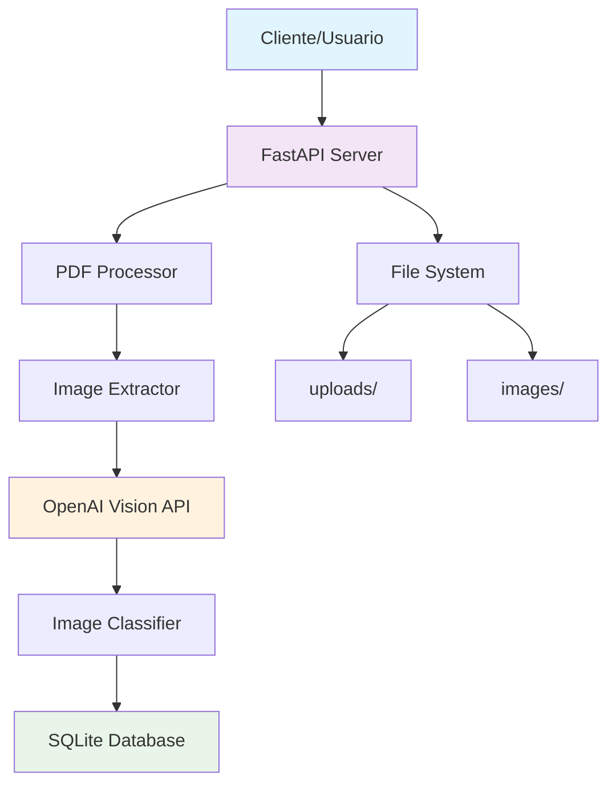

# 🎯 Sistema de Clasificación de Imágenes PDF

> **Sistema inteligente para extraer y clasificar imágenes de documentos PDF usando IA**

[](https://fastapi.tiangolo.com/)
[](https://openai.com/)
[](https://sqlite.org/)
[](https://python.org/)

---

## 📋 Índice

- [🎯 Descripción](#-descripción)
- [🏗️ Arquitectura](#️-arquitectura)
- [⚙️ Características](#️-características)
- [🛠️ Instalación](#️-instalación)
- [🚀 Ejecución](#-ejecución)
- [📡 API Endpoints](#-api-endpoints)
- [🧪 Pruebas](#-pruebas)
- [📊 Base de Datos](#-base-de-datos)
- [🔧 Configuración](#-configuración)
- [📝 Ejemplos](#-ejemplos)
- [🐛 Troubleshooting](#-troubleshooting)
- [📚 Documentación Adicional](#-documentación-adicional)

---

## 🎯 Descripción

**Sistema de Clasificación de Imágenes PDF** es una aplicación web que utiliza inteligencia artificial para **extraer automáticamente imágenes de documentos PDF** y **clasificarlas en tres categorías**:

- 🗺️ **Map** - Mapas, diagramas geográficos, planos
- 📊 **Table** - Tablas, gráficos, datos estructurados  
- 📷 **Picture** - Fotografías, ilustraciones, imágenes generales

### 🎪 Casos de Uso

- **Análisis de reportes financieros** - Separar gráficos de tablas
- **Procesamiento de documentos técnicos** - Identificar mapas y diagramas
- **Digitalización de archivos** - Catalogar contenido visual automáticamente
- **Investigación académica** - Extraer y clasificar material visual

---

## 🏗️ Arquitectura

### 📐 Diagrama de Arquitectura



### 🔄 Flujo de Procesamiento

```
1. Upload PDF → 2. Extract Images → 3. AI Classification → 4. Store Results → 5. Return JSON
     ↓              ↓                  ↓                ↓              ↓
File System    PyMuPDF Library    OpenAI GPT-4 Vision  SQLite DB    REST API
```

### 🧩 Componentes Principales

| Componente | Tecnología | Función |
|------------|------------|---------|
| **API Server** | FastAPI | Endpoints REST, validación, documentación automática |
| **PDF Processor** | PyMuPDF (fitz) | Extracción eficiente de imágenes desde PDF |
| **AI Classifier** | OpenAI GPT-4 Vision | Clasificación inteligente de imágenes |
| **Database** | SQLite | Almacenamiento persistente de metadatos |
| **File Storage** | Sistema de archivos local | Almacenamiento de PDFs e imágenes |

---

## ⚙️ Características

### 🌟 Características Principales

- **🚀 Procesamiento Asíncrono** - Upload instantáneo, procesamiento en background
- **🎯 Alta Precisión** - Utiliza OpenAI GPT-4 Vision para clasificación
- **📊 Base de Datos Persistente** - SQLite para almacenamiento local
- **📚 Documentación Automática** - Swagger UI integrado
- **🔍 API RESTful** - Endpoints estándar con validación completa
- **💾 Almacenamiento Local** - Sin dependencias de servicios externos
- **🛡️ Validación Robusta** - Manejo completo de errores
- **📈 Escalable** - Arquitectura modular y extensible

### 🎨 Características Técnicas

- **Extracción Eficiente** - PyMuPDF para procesamiento rápido de PDFs
- **Clasificación Multi-modal** - Análisis visual + textual de imágenes
- **Almacenamiento Optimizado** - Compresión automática de imágenes
- **Metadatos Completos** - Tracking de página, posición, confianza
- **Background Processing** - No bloquea la interfaz de usuario
- **Error Recovery** - Mecanismos de respaldo ante fallos

---

## 🛠️ Instalación

### 📋 Requisitos Previos

- **Python 3.8+** instalado
- **OpenAI API Key** (cuenta OpenAI requerida)
- **Git** para clonar el repositorio
- **Navegador web** para documentación

### 🔧 Instalación Paso a Paso

#### 1. Clonar el Repositorio
```bash
git clone <repository-url>
cd image-classifier
```

#### 2. Crear Entorno Virtual
```bash
# Crear entorno virtual
python -m venv venv

# Activar entorno virtual
# Linux/Mac:
source venv/bin/activate
# Windows:
venv\Scripts\activate
```

#### 3. Instalar Dependencias
```bash
pip install -r requirements.txt
```

#### 4. Configurar Variables de Entorno
```bash
# Crear archivo .env
echo "OPENAI_API_KEY=tu-api-key-aqui" > .env
echo "UPLOAD_DIR=uploads" >> .env
echo "IMAGES_DIR=images" >> .env
echo "DATABASE_URL=sqlite:///./database.db" >> .env
```

#### 5. Crear Directorios Necesarios
```bash
mkdir uploads images
```

### 📦 Dependencias

```txt
fastapi==0.104.1          # Framework web asíncrono
uvicorn==0.24.0           # Servidor ASGI
python-multipart==0.0.6   # Manejo de multipart/form-data
PyMuPDF==1.23.14          # Procesamiento de PDF
openai==1.3.7             # Cliente OpenAI API
python-dotenv==1.0.0      # Variables de entorno
pillow==10.1.0            # Procesamiento de imágenes
pydantic==2.5.0           # Validación de datos
```

---

## 🚀 Ejecución

### ⚡ Ejecutar la Aplicación

#### Opción 1: Con uvicorn (Recomendado)
```bash
uvicorn app:app --reload --host 0.0.0.0 --port 8000
```

#### Opción 2: Con Python
```bash
python app.py
```

#### Opción 3: Con configuración avanzada
```bash
uvicorn app:app --reload --log-level debug --access-log
```

### ✅ Verificar Funcionamiento

```bash
# Health check
curl http://localhost:8000/health

# Respuesta esperada:
# {"status":"healthy","timestamp":"2024-01-15T12:00:00.123456"}
```

### 🌐 Interfaces Disponibles

- **API Base**: http://localhost:8000
- **Documentación Swagger**: http://localhost:8000/docs  
- **Documentación ReDoc**: http://localhost:8000/redoc
- **Health Check**: http://localhost:8000/health

---

## 📡 API Endpoints

### 📊 Resumen de Endpoints

| Método | Endpoint | Descripción | Autenticación |
|--------|----------|-------------|---------------|
| `GET` | `/health` | Verificación de estado | No |
| `POST` | `/upload-pdf/` | Subir y procesar PDF | No |
| `GET` | `/status/{document_id}` | Estado del procesamiento | No |
| `GET` | `/documents/` | Listar todos los documentos | No |

### 🔍 Detalles de Endpoints

#### 1. Health Check
```http
GET /health
```

**Respuesta:**
```json
{
  "status": "healthy",
  "timestamp": "2024-01-15T12:00:00.123456"
}
```

#### 2. Upload PDF
```http
POST /upload-pdf/
Content-Type: multipart/form-data

file: [PDF_FILE]
```

**Respuesta:**
```json
{
  "document_id": "550e8400-e29b-41d4-a716-446655440000",
  "filename": "documento.pdf",
  "status": "uploaded",
  "message": "Document is being processed in background"
}
```

**Validaciones:**
- ✅ Solo archivos PDF
- ✅ Tamaño máximo: 50MB
- ✅ Nombre de archivo válido

#### 3. Document Status
```http
GET /status/{document_id}
```

**Respuesta:**
```json
{
  "document_id": "550e8400-e29b-41d4-a716-446655440000",
  "filename": "documento.pdf",
  "upload_time": "2024-01-15T10:30:00",
  "total_images": 5,
  "processed": true,
  "classifications": [
    {
      "classification": "Map",
      "confidence": 0.95,
      "filename": "document_p0_i0.jpg",
      "page_number": 0
    }
  ],
  "summary": {
    "maps": 2,
    "tables": 2,
    "pictures": 1
  }
}
```

#### 4. List Documents
```http
GET /documents/
```

**Respuesta:**
```json
{
  "documents": [
    {
      "document_id": "550e8400-e29b-41d4-a716-446655440000",
      "filename": "documento.pdf",
      "upload_time": "2024-01-15T10:30:00",
      "total_images": 5,
      "processed": true,
      "classified_images": 5
    }
  ]
}
```

---

## 🧪 Pruebas

### 🔨 Pruebas con cURL

#### Test 1: Health Check
```bash
curl -X GET "http://localhost:8000/health"
```

#### Test 2: Upload PDF
```bash
curl -X POST "http://localhost:8000/upload-pdf/" \
  -H "accept: application/json" \
  -F "file=@documento.pdf"
```

#### Test 3: Check Status
```bash
# Usar document_id del paso anterior
curl -X GET "http://localhost:8000/status/550e8400-e29b-41d4-a716-446655440000"
```

#### Test 4: List Documents
```bash
curl -X GET "http://localhost:8000/documents/"
```

### 📮 Colección de Postman

Se incluye una colección completa de Postman con:
- ✅ Tests automáticos
- ✅ Variables automáticas
- ✅ Ejemplos de respuesta
- ✅ Validaciones integradas

**Archivo**: `image-classifier-api.postman_collection.json`

### 🧪 Secuencia de Prueba Completa

```bash
#!/bin/bash
echo "=== Test Suite Completo ==="

echo "1. Health Check..."
curl -s http://localhost:8000/health | jq '.'

echo -e "\n2. Upload PDF..."
RESPONSE=$(curl -s -X POST "http://localhost:8000/upload-pdf/" \
  -F "file=@test.pdf")
echo $RESPONSE | jq '.'

DOC_ID=$(echo $RESPONSE | jq -r '.document_id')

echo -e "\n3. Waiting for processing..."
sleep 10

echo -e "\n4. Check Status..."
curl -s "http://localhost:8000/status/$DOC_ID" | jq '.'

echo -e "\n5. List All Documents..."
curl -s http://localhost:8000/documents/ | jq '.'
```

---

## 📊 Base de Datos

### 🗄️ Esquema de Base de Datos

#### Tabla: `documents`
```sql
CREATE TABLE documents (
    id TEXT PRIMARY KEY,           -- UUID único del documento
    filename TEXT NOT NULL,       -- Nombre original del archivo
    upload_time TEXT NOT NULL,    -- Timestamp de subida
    total_images INTEGER DEFAULT 0, -- Total de imágenes encontradas
    processed BOOLEAN DEFAULT FALSE -- Estado de procesamiento
);
```

#### Tabla: `image_classifications`
```sql
CREATE TABLE image_classifications (
    id TEXT PRIMARY KEY,              -- ID único de la imagen
    document_id TEXT NOT NULL,       -- FK a documents.id
    page_number INTEGER NOT NULL,    -- Número de página (0-indexed)
    image_index INTEGER NOT NULL,    -- Índice de imagen en página
    filename TEXT NOT NULL,          -- Nombre del archivo de imagen
    classification TEXT NOT NULL,    -- Map, Table, o Picture
    confidence REAL NOT NULL,        -- Nivel de confianza (0-1)
    processing_time REAL NOT NULL,   -- Tiempo de procesamiento en segundos
    created_at TEXT NOT NULL,        -- Timestamp de creación
    
    FOREIGN KEY (document_id) REFERENCES documents (id)
);
```

### 🔍 Consultas Útiles

#### Ver todos los documentos
```sql
SELECT * FROM documents ORDER BY upload_time DESC;
```

#### Ver clasificaciones por documento
```sql
SELECT 
    d.filename,
    ic.classification,
    ic.confidence,
    ic.page_number
FROM documents d
JOIN image_classifications ic ON d.id = ic.document_id
WHERE d.id = 'document-id-here'
ORDER BY ic.page_number, ic.image_index;
```

#### Estadísticas de clasificación
```sql
SELECT 
    classification,
    COUNT(*) as total,
    AVG(confidence) as avg_confidence,
    AVG(processing_time) as avg_processing_time
FROM image_classifications
GROUP BY classification;
```

### 🛠️ Mantenimiento de Base de Datos

```bash
# Conectar a SQLite
sqlite3 database.db

# Ver estructura
.schema

# Backup
cp database.db database_backup_$(date +%Y%m%d).db

# Limpiar datos de prueba
DELETE FROM image_classifications;
DELETE FROM documents;

# Optimizar base de datos
VACUUM;
```

---

## 🔧 Configuración

### 🌐 Variables de Entorno

```bash
# .env file
OPENAI_API_KEY=sk-your-api-key-here        # Requerido: OpenAI API Key
UPLOAD_DIR=uploads                         # Directorio para PDFs subidos
IMAGES_DIR=images                          # Directorio para imágenes extraídas
DATABASE_URL=sqlite:///./database.db       # URL de base de datos SQLite
MAX_FILE_SIZE=52428800                     # Tamaño máximo de archivo (50MB)
PROCESSING_TIMEOUT=300                     # Timeout de procesamiento (5 min)
```

### ⚙️ Configuración Avanzada

#### Logging
```python
# En app.py
import logging

logging.basicConfig(
    level=logging.INFO,
    format='%(asctime)s - %(name)s - %(levelname)s - %(message)s',
    handlers=[
        logging.FileHandler('app.log'),
        logging.StreamHandler()
    ]
)
```

#### Límites de Rate Limiting (Futuro)
```python
from slowapi import Limiter
from slowapi.util import get_remote_address

limiter = Limiter(key_func=get_remote_address)

@app.post("/upload-pdf/")
@limiter.limit("5/minute")  # 5 uploads por minuto
async def upload_pdf(...):
    ...
```

#### CORS (Para desarrollo web)
```python
from fastapi.middleware.cors import CORSMiddleware

app.add_middleware(
    CORSMiddleware,
    allow_origins=["http://localhost:3000"],  # React app
    allow_methods=["*"],
    allow_headers=["*"],
)
```

---

## 📝 Ejemplos

### 💡 Ejemplo Completo de Uso

#### Paso 1: Preparar ambiente
```bash
# Activar entorno virtual
source venv/bin/activate

# Verificar configuración
cat .env

# Ejecutar aplicación
uvicorn app:app --reload
```

#### Paso 2: Subir documento
```bash
# Subir PDF
curl -X POST "http://localhost:8000/upload-pdf/" \
  -H "accept: application/json" \
  -F "file=@financial_report.pdf"

# Respuesta:
{
  "document_id": "abc123...",
  "filename": "financial_report.pdf",
  "status": "uploaded",
  "message": "Document is being processed in background"
}
```

#### Paso 3: Monitorear progreso
```bash
# Verificar estado cada 30 segundos
while true; do
  STATUS=$(curl -s "http://localhost:8000/status/abc123...")
  PROCESSED=$(echo $STATUS | jq -r '.processed')
  
  if [ "$PROCESSED" = "true" ]; then
    echo "✅ Procesamiento completo!"
    echo $STATUS | jq '.'
    break
  fi
  
  echo "⏳ Procesando..."
  sleep 30
done
```

#### Paso 4: Analizar resultados
```bash
# Ver resumen final
curl -s "http://localhost:8000/status/abc123..." | jq '.summary'

# Resultado:
{
  "maps": 3,
  "tables": 7,
  "pictures": 2
}
```

### 🎯 Casos de Uso Específicos

#### Análisis de Reporte Financiero
```python
import requests
import json

# Subir reporte financiero
with open('quarterly_report.pdf', 'rb') as f:
    response = requests.post(
        'http://localhost:8000/upload-pdf/',
        files={'file': f}
    )

doc_id = response.json()['document_id']

# Esperar procesamiento
import time
while True:
    status = requests.get(f'http://localhost:8000/status/{doc_id}').json()
    if status['processed']:
        break
    time.sleep(10)

# Analizar resultados
tables = [c for c in status['classifications'] if c['classification'] == 'Table']
print(f"Encontradas {len(tables)} tablas financieras")

for table in tables:
    print(f"- Página {table['page_number']}: {table['filename']}")
```

---

## 🐛 Troubleshooting

### ❌ Problemas Comunes

#### Error: "Not Found" en endpoints
```bash
# Verificar que la API esté corriendo
curl http://localhost:8000/health

# Si falla, verificar puerto y reiniciar
uvicorn app:app --reload --port 8000
```

#### Error: "ModuleNotFoundError"
```bash
# Verificar entorno virtual activado
which python

# Reinstalar dependencias
pip install -r requirements.txt --force-reinstall
```

#### Error: "OpenAI API Key not found"
```bash
# Verificar archivo .env
cat .env | grep OPENAI_API_KEY

# Configurar si falta
echo "OPENAI_API_KEY=sk-your-key-here" >> .env
```

#### Error: "File size too large"
```bash
# Verificar tamaño del archivo
ls -lh documento.pdf

# Si es mayor a 50MB, dividir o comprimir
```

#### Error: "Database is locked"
```bash
# Cerrar todas las conexiones y reiniciar
pkill -f "python app.py"
rm database.db
python app.py
```

### 🔧 Comandos de Debugging

#### Logs detallados
```bash
# Ejecutar con debug
uvicorn app:app --reload --log-level debug

# Ver logs en tiempo real
tail -f logs/app.log
```

#### Estado de la base de datos
```bash
sqlite3 database.db "SELECT * FROM documents;"
sqlite3 database.db "SELECT COUNT(*) FROM image_classifications;"
```

#### Limpiar y reiniciar
```bash
# Limpiar todo
rm database.db
rm -rf uploads/* images/*

# Reiniciar
python app.py
```

### 🆘 Soluciones de Emergencia

#### Reset completo del proyecto
```bash
#!/bin/bash
echo "🔄 Reset completo del proyecto..."

# Parar procesos
pkill -f uvicorn
pkill -f "python app.py"

# Limpiar archivos
rm -f database.db
rm -rf uploads/* images/*
rm -rf __pycache__
rm -rf .pytest_cache

# Reinstalar dependencias
pip install -r requirements.txt --force-reinstall

# Recrear directorios
mkdir -p uploads images

# Verificar configuración
if [ ! -f .env ]; then
    echo "❌ Archivo .env no encontrado. Creando..."
    echo "OPENAI_API_KEY=CONFIGURE_ME" > .env
fi

echo "✅ Reset completo. Configure .env y ejecute: uvicorn app:app --reload"
```

---

## 📚 Documentación Adicional

### 🔗 Enlaces Útiles

- **FastAPI Docs**: https://fastapi.tiangolo.com/
- **OpenAI API**: https://platform.openai.com/docs
- **PyMuPDF**: https://pymupdf.readthedocs.io/
- **SQLite**: https://sqlite.org/docs.html

### 📖 Recursos de Aprendizaje

- **Tutorial FastAPI**: https://fastapi.tiangolo.com/tutorial/
- **OpenAI Vision**: https://platform.openai.com/docs/guides/vision
- **Python Async**: https://docs.python.org/3/library/asyncio.html

### 🎓 Conceptos Avanzados

#### Procesamiento Asíncrono
```python
# Background processing con FastAPI
from fastapi import BackgroundTasks

@app.post("/upload/")
async def upload(background_tasks: BackgroundTasks, file: UploadFile):
    background_tasks.add_task(process_file, file)
    return {"message": "Processing started"}
```

#### Manejo de Errores Robusto
```python
try:
    result = await openai_call()
except openai.RateLimitError:
    # Retry con backoff exponencial
    await asyncio.sleep(2 ** retry_count)
except openai.APIError as e:
    # Fallback a clasificación por defecto
    result = {"classification": "Picture", "confidence": 0.1}
```

#### Optimización de Performance
```python
# Procesamiento en lotes
async def process_images_batch(images: List[str]):
    tasks = [classify_image(img) for img in images]
    results = await asyncio.gather(*tasks, return_exceptions=True)
    return results
```

---

## 👥 Contribución

### 🤝 Cómo Contribuir

1. **Fork** el repositorio
2. **Crear** branch de feature (`git checkout -b feature/nueva-funcionalidad`)
3. **Commit** cambios (`git commit -am 'Agregar nueva funcionalidad'`)
4. **Push** al branch (`git push origin feature/nueva-funcionalidad`)
5. **Crear** Pull Request

### 📝 Estándares de Código

- **Seguir PEP 8** para estilo de Python
- **Documentar** todas las funciones públicas
- **Agregar** tests para nuevas funcionalidades
- **Usar** type hints donde sea posible

---

## 📄 Licencia

Este proyecto está bajo la licencia MIT. Ver archivo `LICENSE` para más detalles.

---

## 📞 Soporte

Para soporte técnico o preguntas:

- **Issues**: Crear issue en GitHub
- **Email**: [tu-email@ejemplo.com]
- **Documentación**: http://localhost:8000/docs (cuando la API esté corriendo)

---

## 🚀 Próximas Funcionalidades

- [ ] **Autenticación JWT** para endpoints seguros
- [ ] **Rate limiting** para evitar abuso
- [ ] **Caching Redis** para respuestas rápidas
- [ ] **Batch processing** para múltiples PDFs
- [ ] **Webhook notifications** cuando termine el procesamiento
- [ ] **Docker containerization** para deployment fácil
- [ ] **Metrics y monitoring** con Prometheus
- [ ] **Frontend web** para interfaz gráfica

---

**🎉 ¡El sistema está listo para usar! Ejecuta `uvicorn app:app --reload` y comienza a clasificar imágenes.**