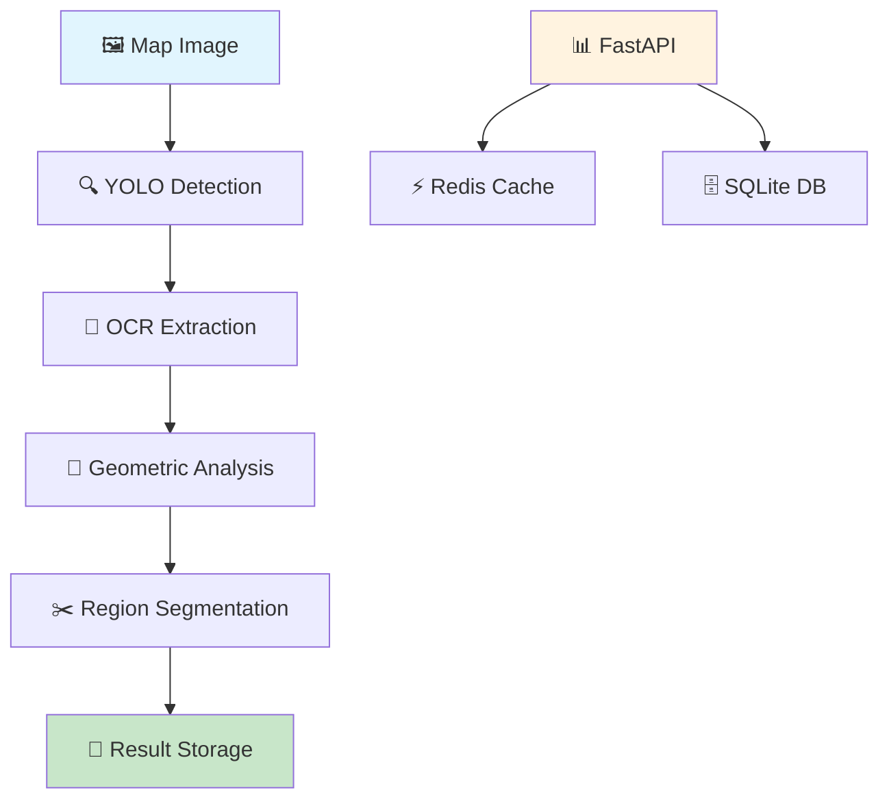

# 🗺️ Geospatial Computer Vision API

[](https://www.python.org/downloads/)
[](https://fastapi.tiangolo.com/)
[](https://docs.docker.com/compose/)
[](https://opensource.org/licenses/MIT)

> Sistema avanzado de visión por computadora para análisis geoespacial automatizado de mapas usando Deep Learning, YOLO, OCR y análisis geométrico.

## 🎯 **Descripción**

**Geospatial Computer Vision API** es una solución completa que combina técnicas de vanguardia en Computer Vision y Deep Learning para extraer automáticamente información geoespacial de imágenes de mapas. El sistema detecta coordenadas, elementos cartográficos y extrae regiones de interés con alta precisión.

### **✨ Características Principales**

- 🤖 **Detección Inteligente**: YOLO para elementos cartográficos (texto, leyendas, escalas)
- 📖 **OCR Avanzado**: Extracción robusta de coordenadas con EasyOCR
- 🧮 **Análisis Geométrico**: Relaciones espaciales y segmentación automática
- ⚡ **Procesamiento Asíncrono**: Jobs no-bloqueantes con Redis + SQLite
- 🐳 **Dockerizado**: Deployment local simplificado
- 📊 **API RESTful**: Endpoints estándar con documentación automática
- 🎯 **Alta Precisión**: Combinación de múltiples técnicas de validación

---

## 🏗️ **Arquitectura del Sistema**



### **🔧 Componentes Técnicos**

| Componente | Tecnología | Función |
|------------|------------|---------|
| **Detección de Objetos** | YOLOv8 | Localizar elementos cartográficos |
| **OCR Engine** | EasyOCR | Extraer texto de coordenadas |
| **Análisis Geométrico** | OpenCV + Shapely | Relaciones espaciales |
| **API Framework** | FastAPI | Endpoints RESTful |
| **Cache** | Redis | Resultados temporales |
| **Database** | SQLite | Persistencia de jobs |
| **Containerization** | Docker Compose | Orquestación de servicios |

---

## 🚀 **Instalación y Configuración**

### **📋 Prerrequisitos**

- Docker 20.10+
- Docker Compose 2.0+
- 4GB RAM mínimo
- 2GB espacio en disco

### **⚡ Instalación Rápida**

```bash
# 1. Clonar el repositorio
git clone https://github.com/tu-usuario/geospatial-cv-api.git
cd geospatial-cv-api

# 2. Crear estructura de carpetas
mkdir -p uploads models

# 3. Descargar modelo YOLO base
cd models
wget https://github.com/ultralytics/assets/releases/download/v0.0.0/yolov8n.pt
cd ..

# 4. Construir y ejecutar servicios
docker-compose up --build

# 5. Verificar instalación
curl http://localhost:8000/health
```

### **🔧 Configuración Avanzada**

#### **Variables de Entorno**
```bash
# .env file (opcional)
REDIS_URL=redis://redis:6379
DATABASE_PATH=geospatial.db
MAX_FILE_SIZE=50MB
PROCESSING_TIMEOUT=300
```

#### **Personalizar Puertos**
```yaml
# docker-compose.yml
services:
  geospatial-api:
    ports:
      - "8080:8000"  # Cambiar puerto si es necesario
```

---

## 📖 **Uso del API**

### **🌐 Documentación Interactiva**

Una vez ejecutando el sistema, accede a:
- **Swagger UI**: http://localhost:8000/docs
- **ReDoc**: http://localhost:8000/redoc

### **🔗 Endpoints Principales**

#### **1. Subir y Analizar Mapa**
```bash
POST /api/v1/analyze-map
```

**Ejemplo con cURL:**
```bash
curl -X POST "http://localhost:8000/api/v1/analyze-map" \
     -H "Content-Type: multipart/form-data" \
     -F "file=@/path/to/your/map.jpg"
```

**Respuesta:**
```json
{
  "job_id": "123e4567-e89b-12d3-a456-426614174000",
  "status": "processing",
  "message": "Map analysis started"
}
```

#### **2. Consultar Estado del Trabajo**
```bash
GET /api/v1/jobs/{job_id}
```

**Ejemplo:**
```bash
curl -X GET "http://localhost:8000/api/v1/jobs/123e4567-e89b-12d3-a456-426614174000"
```

**Respuesta Exitosa:**
```json
{
  "job_id": "123e4567-e89b-12d3-a456-426614174000",
  "status": "completed",
  "created_at": "2024-01-15T10:30:00",
  "result": {
    "detected_objects": [
      {
        "bbox": [100, 200, 300, 250],
        "class_name": "text",
        "confidence": 0.85
      }
    ],
    "coordinates": [
      {
        "lat": 40.7128,
        "lon": -74.0060,
        "confidence": 0.9,
        "text": "40.7128, -74.0060"
      }
    ],
    "regions": [
      {
        "coordinates": [...],
        "segment_path": "uploads/segment_12345.jpg",
        "bbox": [50, 100, 400, 300]
      }
    ]
  }
}
```

#### **3. Descargar Segmento Extraído**
```bash
GET /api/v1/jobs/{job_id}/segments/{segment_name}
```

**Ejemplo:**
```bash
curl -X GET "http://localhost:8000/api/v1/jobs/123e4567-e89b-12d3-a456-426614174000/segments/segment_12345.jpg" \
     --output extracted_segment.jpg
```

#### **4. Health Check**
```bash
GET /health
```

---

## 🗂️ **Estructura del Proyecto**

```
geospatial-cv/
├── 📄 README.md                    # Este archivo
├── 🐳 docker-compose.yml           # Orquestación de servicios
├── 🐳 Dockerfile                   # Imagen de la aplicación
├── 📦 requirements.txt             # Dependencias Python
├── 📁 app/
│   ├── 🚀 main.py                 # API principal (FastAPI)
│   ├── 🏗️ models.py               # Modelos de datos y base de datos
│   ├── ⚙️ services.py             # Lógica de procesamiento
│   └── 🛠️ utils.py                # Utilidades y helpers
├── 📁 models/
│   └── 🧠 yolov8n.pt             # Modelo YOLO pre-entrenado
├── 📁 uploads/                     # Imágenes de entrada y segmentos
├── 📁 tests/ (opcional)
│   ├── 🧪 test_api.py             # Tests de API
│   └── 🧪 test_processing.py      # Tests de procesamiento
└── 📁 docs/
    ├── 📊 postman_collection.json  # Colección de Postman
    └── 📋 api_examples.md          # Ejemplos adicionales
```

---

## 🧠 **Algoritmos y Técnicas**

### **🔍 Pipeline de Procesamiento**

1. **Preprocesamiento de Imagen**
   - Normalización y optimización
   - Detección de calidad de imagen

2. **Detección de Objetos (YOLO)**
   - Localización de texto cartográfico
   - Identificación de leyendas y escalas
   - Detección de líneas de cuadrícula

3. **Extracción de Texto (OCR)**
   - EasyOCR con optimizaciones específicas
   - Post-procesamiento para coordenadas
   - Validación de formatos geoespaciales

4. **Análisis Geométrico**
   - Cálculo de relaciones espaciales
   - Agrupación de coordenadas cercanas
   - Inferencia de regiones de interés

5. **Segmentación y Extracción**
   - Conversión geo-coordenada a píxel
   - Recorte de regiones relevantes
   - Optimización de segmentos

### **📊 Formatos de Coordenadas Soportados**

- **Grados Decimales**: `40.7128, -74.0060`
- **Grados, Minutos, Segundos**: `40°42'46"N, 74°00'22"W`
- **Grados, Minutos**: `40°42.8'N, 74°00.4'W`
- **UTM**: `Zone 18T 583958E 4507527N`

---

## 🛠️ **Desarrollo y Personalización**

### **🔧 Configuración de Desarrollo**

```bash
# Modo desarrollo (sin Docker)
python -m venv venv
source venv/bin/activate  # Linux/Mac
# venv\Scripts\activate   # Windows

pip install -r requirements.txt
uvicorn app.main:app --reload --host 0.0.0.0 --port 8000
```

### **📊 Personalizar Modelo YOLO**

Para mejorar la precisión con tus mapas específicos:

```python
# Entrenar modelo personalizado
from ultralytics import YOLO

# Cargar modelo base
model = YOLO('yolov8n.pt')

# Entrenar con tu dataset
model.train(
    data='path/to/your/dataset.yaml',
    epochs=100,
    imgsz=640,
    batch=16
)
```

### **🎯 Optimizar OCR**

```python
# Configurar EasyOCR para mejor precisión
reader = easyocr.Reader(['en'], 
                       gpu=True,
                       model_storage_directory='/path/to/models',
                       download_enabled=False)

# Parámetros optimizados para coordenadas
results = reader.readtext(image,
                         detail=1,
                         paragraph=False,
                         width_ths=0.7,
                         height_ths=0.7)
```

---

## 📊 **Monitoreo y Performance**

### **⚡ Métricas Esperadas**

| Métrica | Valor Objetivo |
|---------|----------------|
| **Tiempo de Procesamiento** | < 3 segundos/imagen |
| **Precisión de Coordenadas** | > 90% |
| **Detección de Elementos** | > 85% |
| **Throughput** | > 20 imágenes/minuto |

### **📈 Optimizaciones Implementadas**

- ✅ **Cache Redis**: Resultados temporales para evitar reprocesamiento
- ✅ **Procesamiento Asíncrono**: Jobs no-bloqueantes
- ✅ **Validación de Entrada**: Filtros de calidad de imagen
- ✅ **Optimización de Memoria**: Liberación automática de recursos
- ✅ **Configuración Adaptativa**: Parámetros dinámicos según tipo de mapa

---

## 🐛 **Troubleshooting**

### **❌ Problemas Comunes**

#### **Error: "Cannot load image"**
```bash
# Verificar formato de imagen soportado
file your_image.jpg

# Formatos soportados: JPG, PNG, TIFF, BMP
# Tamaño máximo: 50MB por defecto
```

#### **Error: "YOLO model not found"**
```bash
# Descargar modelo YOLO
cd models/
wget https://github.com/ultralytics/assets/releases/download/v0.0.0/yolov8n.pt
```

#### **Error: "Redis connection refused"**
```bash
# Verificar servicios Docker
docker-compose ps

# Reiniciar servicios si es necesario
docker-compose restart redis
```

#### **Performance Issues**
```bash
# Incrementar recursos Docker
docker-compose up --scale geospatial-api=2

# Verificar logs
docker-compose logs -f geospatial-api
```

### **🔍 Logs y Debugging**

```bash
# Ver logs en tiempo real
docker-compose logs -f

# Ver logs específicos del API
docker-compose logs geospatial-api

# Acceder al contenedor para debugging
docker-compose exec geospatial-api bash
```

---

## 🧪 **Testing**

### **🚀 Tests Automáticos**

```bash
# Ejecutar tests unitarios
python -m pytest tests/ -v

# Test de integración con API
python -m pytest tests/test_api.py -v

# Test de performance
python -m pytest tests/test_performance.py -v
```

### **📊 Importar Colección Postman**

1. Abrir Postman
2. Import → File → `docs/postman_collection.json`
3. Configurar variable `base_url` = `http://localhost:8000`
4. Ejecutar workflow automático

---

## 🤝 **Contribución**

### **🔧 Desarrollo**

1. Fork del repositorio
2. Crear branch feature: `git checkout -b feature/nueva-funcionalidad`
3. Commit cambios: `git commit -am 'Agregar nueva funcionalidad'`
4. Push al branch: `git push origin feature/nueva-funcionalidad`
5. Crear Pull Request

### **📋 Estándares de Código**

- **PEP 8** para Python
- **Type Hints** obligatorios
- **Docstrings** para funciones públicas
- **Tests** para nuevas funcionalidades

### **🐛 Reportar Issues**

Incluir en tu reporte:
- Versión del sistema
- Pasos para reproducir
- Logs relevantes
- Imagen de ejemplo (si aplica)

---

## 📄 **Licencia**

Este proyecto está bajo la Licencia MIT. Ver [LICENSE](LICENSE) para más detalles.

---

## 👥 **Autores**

- **Tu Nombre** - *Desarrollo inicial* - [tu-github](https://github.com/tu-usuario)

---

## 🙏 **Agradecimientos**

- **Ultralytics** por YOLOv8
- **JaidedAI** por EasyOCR  
- **FastAPI** por el framework
- **Redis Labs** por Redis
- **OpenCV** community

---

## 📞 **Soporte**

- 📧 **Email**: tu-email@dominio.com
- 🐛 **Issues**: [GitHub Issues](https://github.com/tu-usuario/geospatial-cv-api/issues)
- 💬 **Discussions**: [GitHub Discussions](https://github.com/tu-usuario/geospatial-cv-api/discussions)

---

<div align="center">

**⭐ ¡Si este proyecto te es útil, dale una estrella! ⭐**

Made with ❤️ for the Geospatial Community

</div>